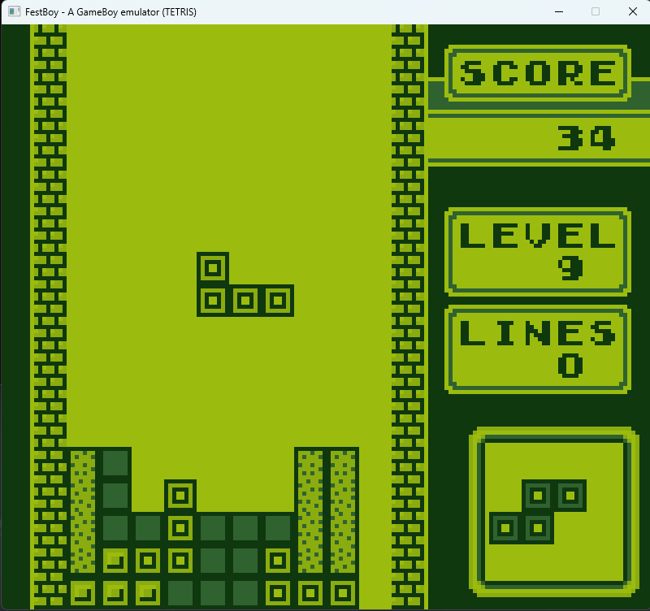

# FestBoy

A cycle-accurate Game Boy Emulator currently under development written with C++ and CMake.

## Screenshot

## Copyright

FestBoy is Copyright © 2023 - 2023 pabletefest.
It is licensed under the terms of the GNU General Public License (GPL) 3.0 or any later version. See LICENSE for details.

Nintendo Game Boy is a registered trademark of Nintendo Co., Ltd.
